## What are Camunda Forms?

Camunda Forms is one of the handling a User Task on Tasklist. These Forms can be created on the Camunda Modeler where they can also be embedded to the BPMN file with your Diagram and assign a Form to a User Task.

After deploying a Diagram with an embedded Form, Tasklist will import this Form schema to the API where every Task that is assigned to this Form will be related to the Form schema on the API.

All new tasks that have a form assigned to it on the BPMN diagram will render the form modeled on the Camunda Modeler. The fields will be pre-filled with variables with the same names as the respective fields. When the task is complete, variables will be updated or created based on the field names of the form.

## How to use Camunda Forms?

### Modeling the diagram and form

Open the Camunda Modeler and create a new diagram for the Zeebe Engine.
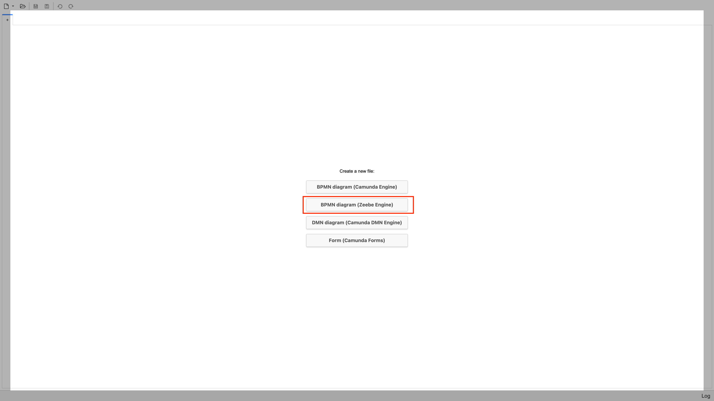

Model a process with a User Task
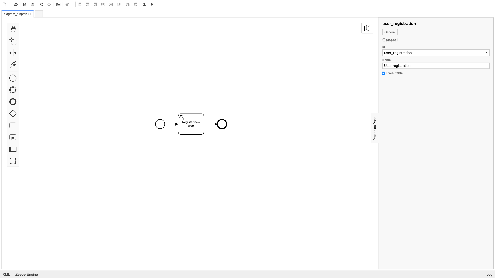

Now create a form by clicking on Form (Camunda Forms)
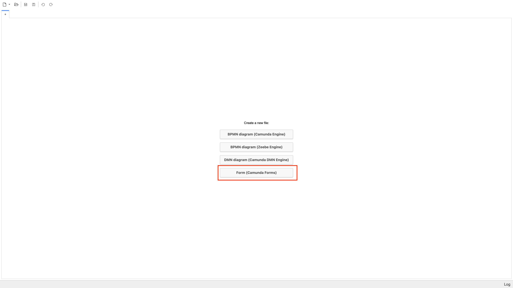

Model your form and click on the bottom left corner that says JSON to switch to the JSON view.

Pay attention when naming the fields of your form, fields will have their values prefilled from variables that have the same name.

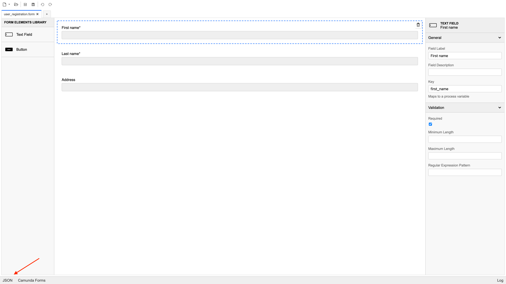

Copy the JSON schema
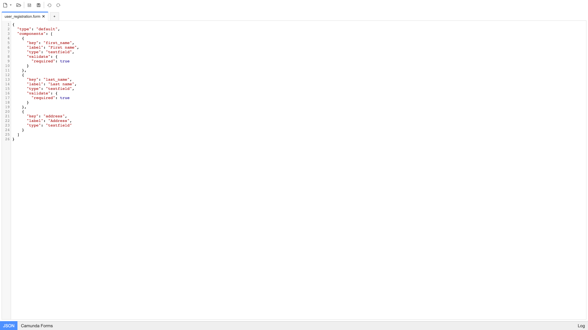

Go back to the BPMN Diagram you modeled earlier, select the User Task, and click on the Forms tab. After switching tabs you should see the field where you can paste the form JSON schema. Paste the schema and save the file.
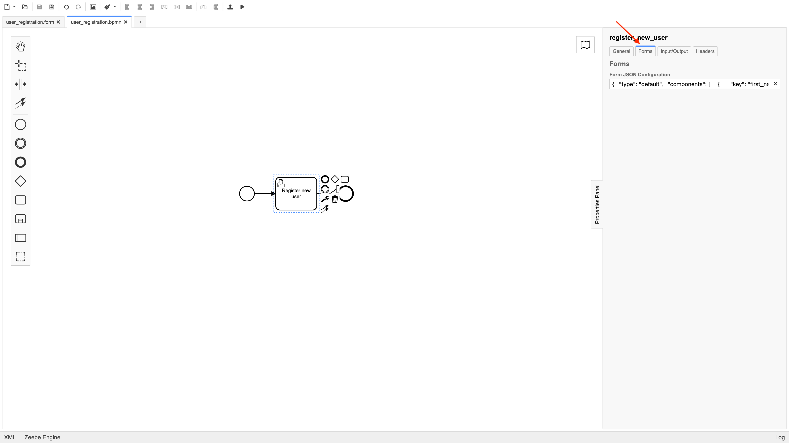

### Deploying the Diagram

Deploy your diagram to Zeebe and create an instance.

```sh
zbctl deploy /path/to/my/diagram.bpmn
zbctl create instance diagram-id
```

### Completing the Task

Now open Tasklist, you should see an unclaimed Task, click on it and the details will open with the form you modeled earlier.
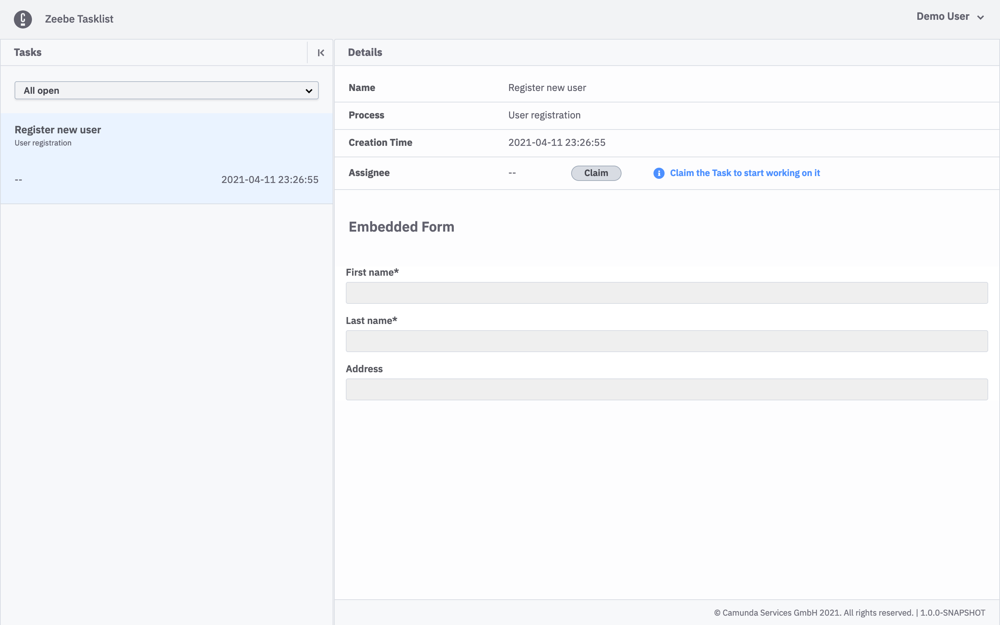

Claim this Task, fill the form, and complete the Task.
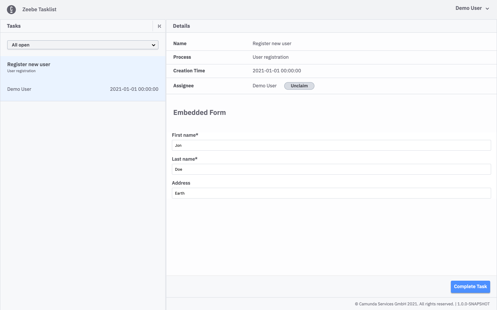

If you filter by Completed Tasks you should see your Task listed there.
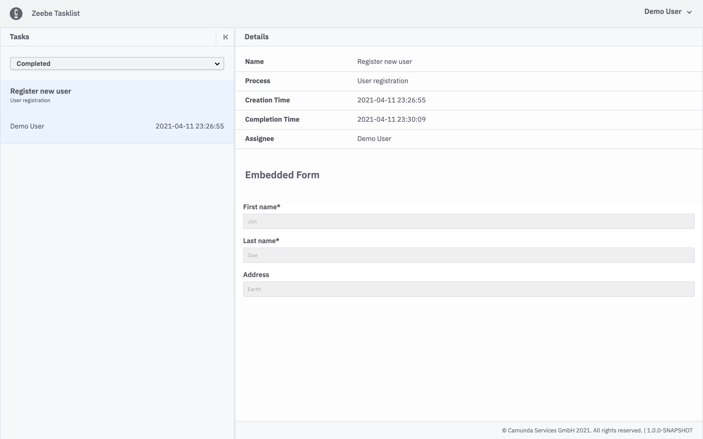

### Checking Instance on Operate

If you go to Operate you should see your Instance complete (if your Diagram consisted of only 1 User Task).
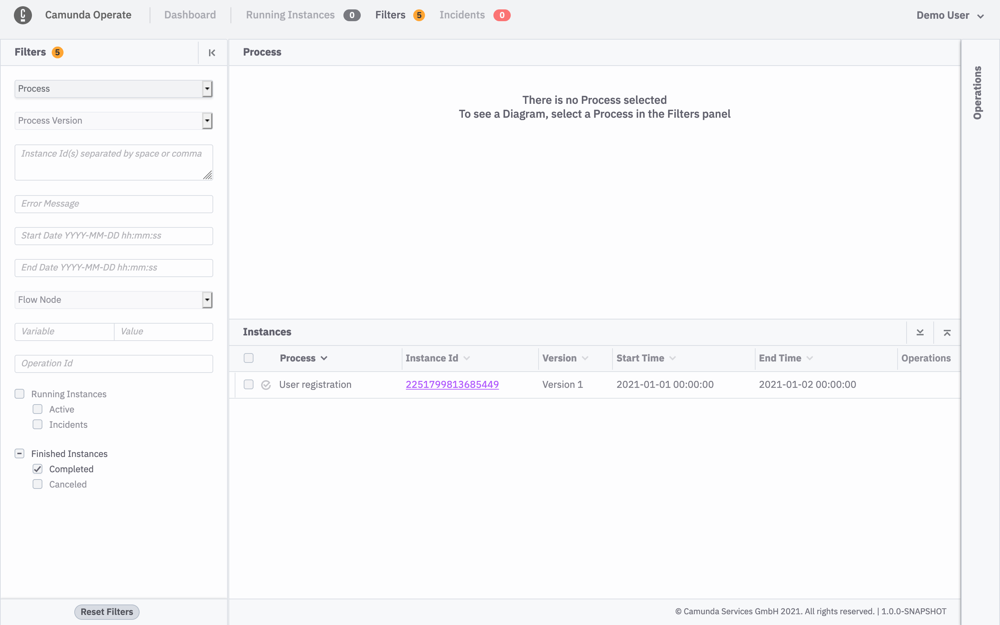

Go to the Instance details page, you can see that values you filled on the form are now Process Variables.
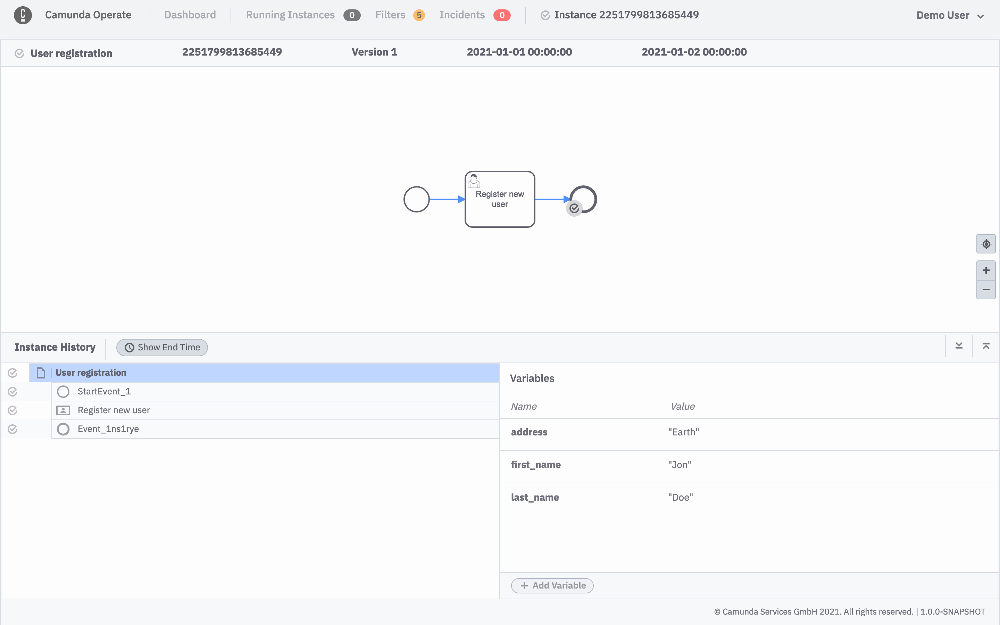
